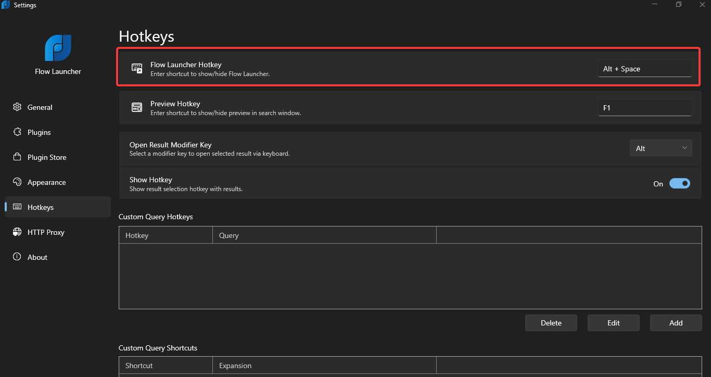

# Flow Launcher LWin Plugin

This is a simple plugin designed to activate Flow Launcher using the `LWin` (Left Windows) button instead of the default `Alt` + `Space` hotkey.

## Installation

1. Begin by installing the plugin.
2. Ensure that your Flow Launcher hotkey is set to `Alt + Space`.

   

## Usage

- To trigger Flow Launcher, simply press the `LWin` button.
- For Main Windows shortcuts like `Win + R` or `Win + D`:

  - Hold down the `LWin` button until the timeout exceeds `200 ms` by default (which can be changed in settings), then press the desired key combination.

- To show the start menu, hold down the `LWin` button until the timeout exceeds `200 ms`, then release the `LWin` button.
